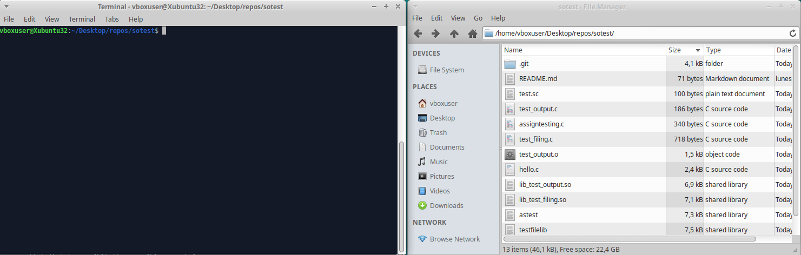
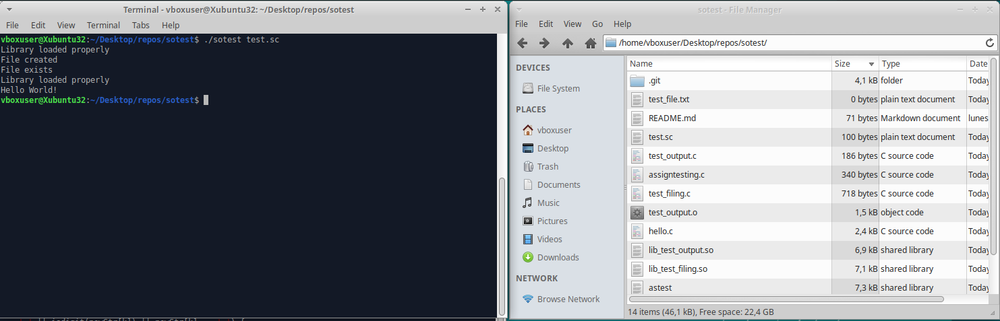
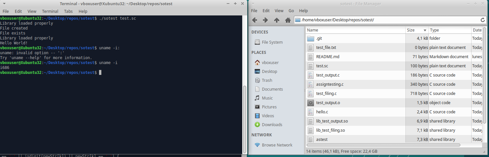

# Test: SO
scripting language interpreter for shared function libraries.

### Compilation & execution
gcc -finput-charset=utf-9 hello.c -ldl -o sotest  
./sotest test.sc  

## Test Shared Libraries
### lib_test_filing
functions for handling files  
createTestFile(): create a test_file.txt empty  
checkTestFile(): check if theres a test_file.txt in the root dir of the project  
deleteTestFile(): delete the test_file.txt if is in the directory  

### lib_test_output
functions for printf in console  
helloWorld(): prints "Hello World!"  
goobyeWorld(): prints "Goobye World!"  

### test_output

## Machine

Oracle VirtualBox  
Xubuntu 18.04.5  
32bit i686  
